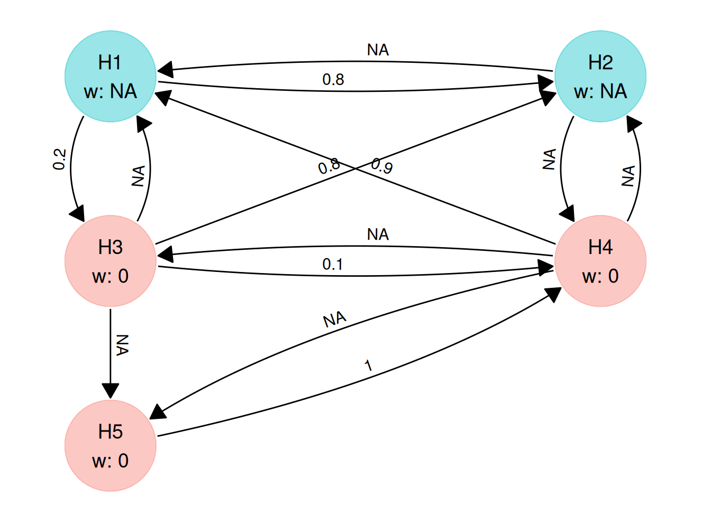
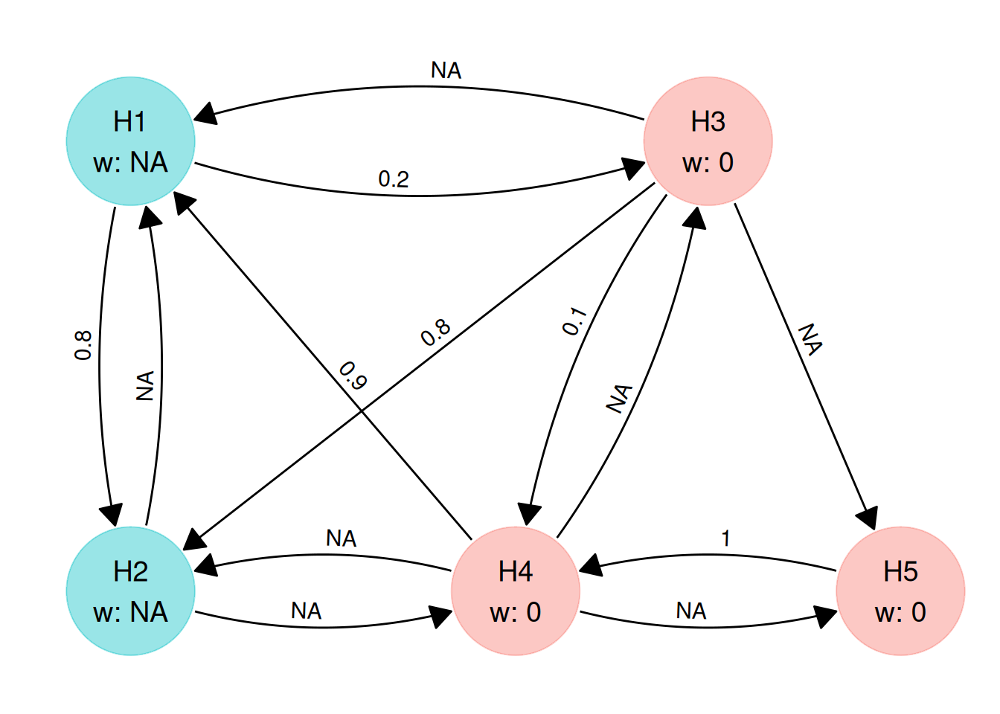
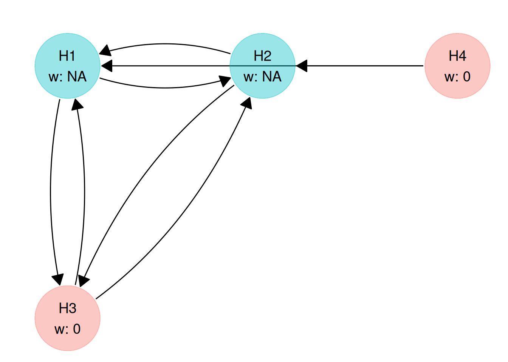
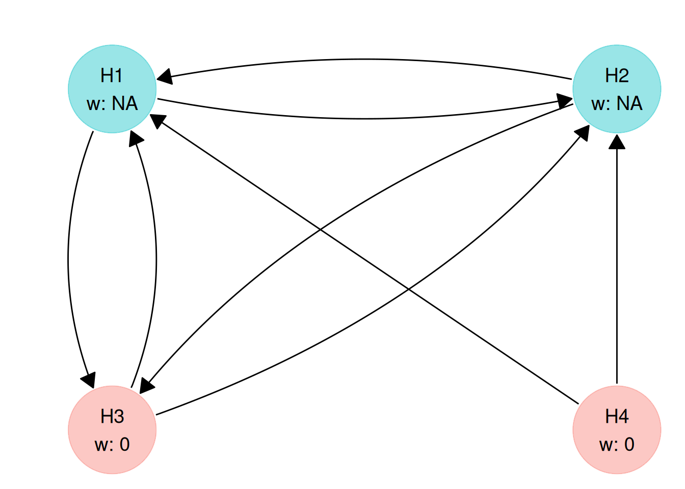
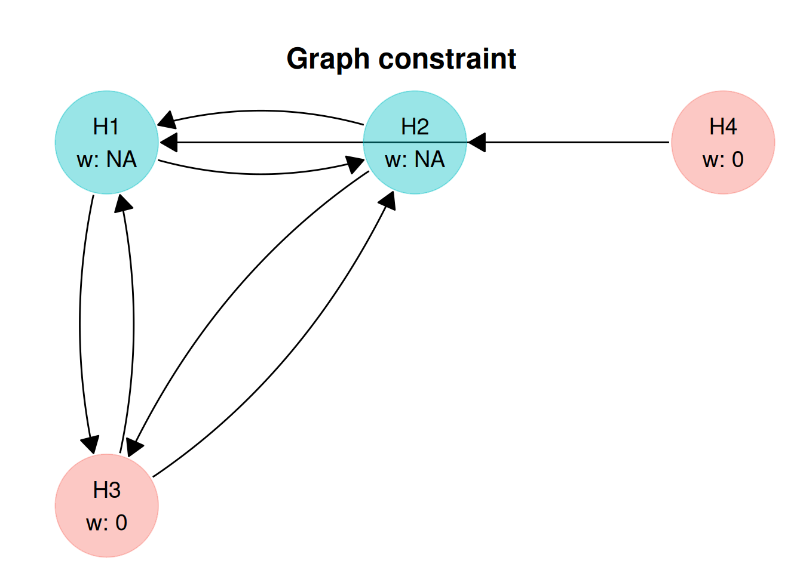
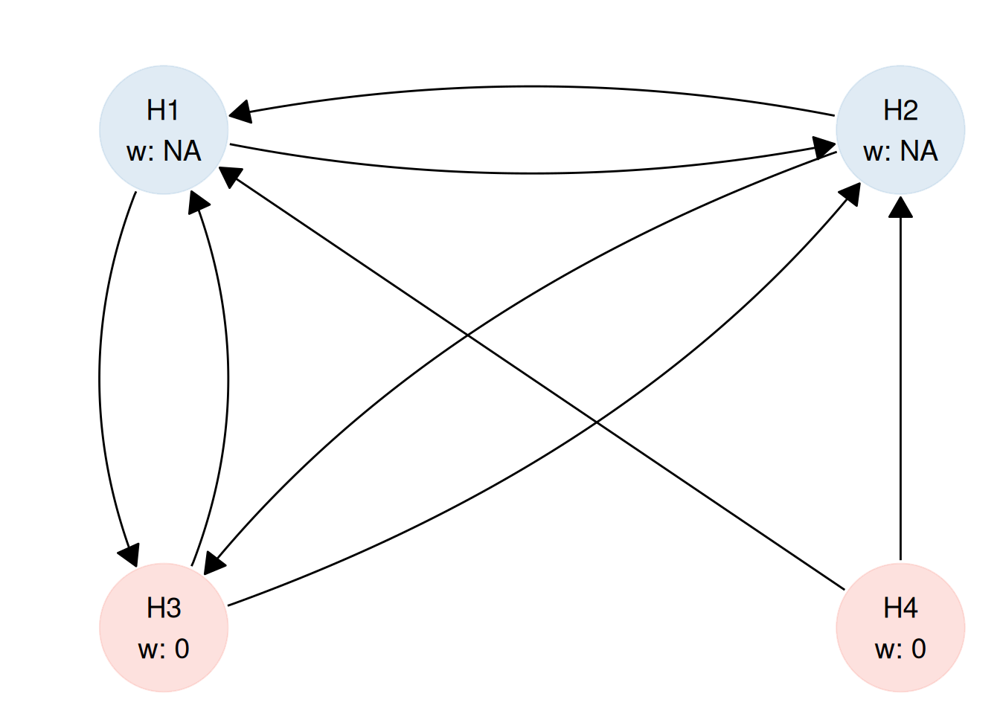

# Graph constraints

## Why use graph constraints?

When setting up a graphical testing procedure, there are two main
challenges:

- *Reflecting design intent*: Often we already know certain structure of
  our graphical test from the protocol: for example, that only primary
  endpoints should receive initial *alpha*, or that *alpha* should not
  recycle back from secondary to primary endpoints. Encoding these as
  constraints ensures the graph matches the intended hierarchy and
  clinical priorities, without having to optimise every transition
  weight.

- *Speeding up the optimisation*. If every hypothesis and transition
  weight is optimised, the search space quickly can be become very
  large, especially when you have many hypotheses to test. Constraints
  on the graph allow you to fix what is already decided and only
  optimise what is genuinely uncertain, making the optimisation
  procedure faster and results easier to interpret.

A `multigrain_graph_constraint` object lets you optimise a graph within
these rules directly: fixed values where the design is pre-specified,
and `NA` where optimisation is allowed. This makes it easier to find
valid graphs that are aligned with the trial design and computationally
tractable to optimise.

## Create a graph constraint

A graph constraint object defines the constraints on the hypothesis
weight vector and transition matrix for optimisation of graph-based
multiple testing procedures.

There are several ways to build a graph constraint:

1.  by supplying both the vector of constraints on the hypothesis weight
    (`hyp_constraint`) and the matrix defining the constraints on the
    transition between hypotheses (`trans_constraint`).
2.  by supplying either `hyp_constraint` or `trans_constraint`. If
    supplying only one of the key components, the other one will be
    regarded as unconstrained (all parameters are free to be optimised).
3.  by supplying the number of hypotheses (`m`). In this case both the
    hypothesis weight vector and the transition matrix will be
    unconstrained.

### From `hyp_constraint` and `trans_constraint`

The main function used to build a `multigrain_graph_constraint` is
[`graph_constraint()`](https://gsk-biostatistics.github.io/multigrain/dev/reference/graph_constraint.md).
You can access its documentation with
[`?graph_constraint`](https://gsk-biostatistics.github.io/multigrain/dev/reference/graph_constraint.md).
It takes several arguments, 2 of which we have already mentioned
(`hyp_constraint` and `trans_constraint`).

``` r

gc <- graph_constraint(
    hyp_constraint = c(NA, NA, 0, 0),
    trans_constraint = matrix(
    c(
      0, NA, NA, 0,
      NA, 0, NA, 0,
      NA, NA, 0, 0,
      NA, NA, 0, 0
    ),
    nrow = 4,
    byrow = TRUE
  )
)

gc
#> <multigrain_graph_constraint>
#> Constraints on hypothesis weights:
#> H1 H2 H3 H4 
#> NA NA  0  0 
#> 
#> Constraints on transition matrix:
#>    H1 H2 H3 H4
#> H1  0 NA NA  0
#> H2 NA  0 NA  0
#> H3 NA NA  0  0
#> H4 NA NA  0  0
```

In the example above names were automatically generated (`"H1"`, `"H2"`,
`"H3"`, and `"H4"`). This is controlled by the `names` *optional*
argument, which, if unspecified, will name the hypotheses `"H1"`,
`"H2"`, etc.

We can also supply custom names.

``` r

gc_named <- graph_constraint(
    hyp_constraint = c(NA, NA, 0, 0),
    trans_constraint = matrix(
    c(
      0, NA, NA, 0,
      NA, 0, NA, 0,
      NA, NA, 0, 0,
      NA, NA, 0, 0
    ),
    nrow = 4,
    byrow = TRUE
  ),
    names = c("FVC", "FEV1", "PRO", "QALY")
)

gc_named
#> <multigrain_graph_constraint>
#> Constraints on hypothesis weights:
#>  FVC FEV1  PRO QALY 
#>   NA   NA    0    0 
#> 
#> Constraints on transition matrix:
#>      FVC FEV1 PRO QALY
#> FVC    0   NA  NA    0
#> FEV1  NA    0  NA    0
#> PRO   NA   NA   0    0
#> QALY  NA   NA   0    0
```

### From `hyp_constraint` only

A `multigrain_graph_constraint` object can also be build by supplying
only the `hyp_constraint`.

When a `trans_constraint` is not present, its dimensions will be derived
from the `hyp_constraint`. In this case `hyp_constraint` has 4 elements,
therefore `trans_matrix` will be a 4-by-4 square matrix with all 0 on
the diagonal and all other values being `NA`. This translates in
[`graph_optimise()`](https://gsk-biostatistics.github.io/multigrain/dev/reference/graph_optimise.md)
later being allowed to optimise any parameter.

``` r

gc_hyp_cnstr_only <- graph_constraint(
    hyp_constraint = c(NA, NA, 0, 0)
)

gc_hyp_cnstr_only
#> <multigrain_graph_constraint>
#> Constraints on hypothesis weights:
#> H1 H2 H3 H4 
#> NA NA  0  0 
#> 
#> Constraints on transition matrix:
#>    H1 H2 H3 H4
#> H1  0 NA NA NA
#> H2 NA  0 NA NA
#> H3 NA NA  0 NA
#> H4 NA NA NA  0
```

### From `trans_constraint` only

In a similar manner, we can supply only a `trans_constraint` in which
case `hyp_constraint` will be assumed to have no constraints and similar
dimensions.

``` r

gc_trans_cnstr_only <- graph_constraint(
    trans_constraint = matrix(
    c(
      0, NA, NA, 0,
      NA, 0, NA, 0,
      NA, NA, 0, 0,
      NA, NA, 0, 0
    ),
    nrow = 4,
    byrow = TRUE
  )
)

gc_trans_cnstr_only
#> <multigrain_graph_constraint>
#> Constraints on hypothesis weights:
#> H1 H2 H3 H4 
#> NA NA NA NA 
#> 
#> Constraints on transition matrix:
#>    H1 H2 H3 H4
#> H1  0 NA NA  0
#> H2 NA  0 NA  0
#> H3 NA NA  0  0
#> H4 NA NA  0  0
```

### “Free” graph constraint

In a “free” graph constraint, all constraints are removed making all
weights and transition values optimisable:

``` r

# we only need to supply the number of hypotheses
graph_constraint_free(5)
#> <multigrain_graph_constraint>
#> Constraints on hypothesis weights:
#> H1 H2 H3 H4 H5 
#> NA NA NA NA NA 
#> 
#> Constraints on transition matrix:
#>    H1 H2 H3 H4 H5
#> H1  0 NA NA NA NA
#> H2 NA  0 NA NA NA
#> H3 NA NA  0 NA NA
#> H4 NA NA NA  0 NA
#> H5 NA NA NA NA  0
```

## Validation

If
[`graph_constraint()`](https://gsk-biostatistics.github.io/multigrain/dev/reference/graph_constraint.md)
runs successfully, it always creates a valid
`multigrain_graph_constraint` object. The validation happens
automatically and consists of multiple checks. If any of them fail,
[`graph_constraint()`](https://gsk-biostatistics.github.io/multigrain/dev/reference/graph_constraint.md)
will throw an error.

The validation is silent when all the checks pass:

``` r

gc5 <- graph_constraint(
    c(NA, NA, 0, 0, 0),
    matrix(
    c(
      0, 0.8, 0.2, 0, 0,
      NA, 0, 0, NA, 0,
      0, 0.9, 0, 0.1, 0,
      0.9, NA, NA, 0, 0,
      1, 0, 0, 0, 0
    ),
    nrow = 5,
    byrow = TRUE
  )
)

gc5
#> <multigrain_graph_constraint>
#> Constraints on hypothesis weights:
#> H1 H2 H3 H4 H5 
#> NA NA  0  0  0 
#> 
#> Constraints on transition matrix:
#>     H1  H2  H3  H4 H5
#> H1 0.0 0.8 0.2 0.0  0
#> H2  NA 0.0 0.0  NA  0
#> H3 0.0 0.9 0.0 0.1  0
#> H4 0.9  NA  NA 0.0  0
#> H5 1.0 0.0 0.0 0.0  0
```

And throws an error at the first failing check:

``` r

graph_constraint(
    hyp_constraint = c(NA, NA, 0, 0, 0),
    trans_constraint = matrix(
    c(
      0, 0.8, 0.2, NA, 0,
      NA, 0, 0, NA, 0,
      0, 0.9, 0, 0.1, 0,
      0.9, NA, NA, 0, 0,
      1, 0, 0, 0, 0
    ),
    nrow = 5,
    byrow = TRUE
  )
)
#> Error in `graph_constraint()`:
#> ! At least one incomplete transition matrix row has a single optimisable
#>   (i.e. `NA`) value.
#> ℹ For a more detailed diagnosis run `graph_constraint()` with `diagnose =
#>   TRUE`.
```

If a detailed diagnosis is desired (especially if we suspect there might
be multiple failing checks), we can call
[`graph_constraint()`](https://gsk-biostatistics.github.io/multigrain/dev/reference/graph_constraint.md)
with `diagnose = TRUE` (the default value for `diagnose` being `FALSE`).
In this case, we are informed our transition matrix constraint would
actually fail 2 of the checks:

- a single value to optimise on row 1 (which can effectively be set to
  `0`), and
- an *incomplete* row already adding up to `1` (same row).

``` r

graph_constraint(
    hyp_constraint = c(NA, NA, 0, 0, 0),
    trans_constraint = matrix(
    c(
      0, 0.8, 0.2, NA, 0,
      NA, 0, 0, NA, 0,
      0, 0.9, 0, 0.1, 0,
      0.9, NA, NA, 0, 0,
      1, 0, 0, 0, 0
    ),
    nrow = 5,
    byrow = TRUE
  ),
    diagnose = TRUE
)
#> 
#> ── Hypothesis weight constraint diagnosis:
#> ✔ All hypothesis weights constraint values are less than or equal to 1.
#> ✔ All hypothesis weights constraint values are greater than or equal to 0.
#> ✔ The hypothesis weights constraint vector is correctly defined for optimising 2 weights.
#> ✔ The sum of the incomplete hypothesis weights constraint vector is less than 1.
#> 
#> ── Transition matrix constraint diagnosis:
#> ✔ All values on the transition matrix diagonal are 0.
#> ✔ The transition matrix is square.
#> ✔ All transition matrix values are less than or equal to 1.
#> ✔ All transition matrix values are greater than or equal to 0.
#> ✖ At least one incomplete transition matrix row has a single optimisable (i.e. `NA`) value.
#>   • Row 1: [0, 0.8, 0.2, NA, 0] the optimisable value is effectively equal to
#>   0.
#> ✔ All complete transition matrix rows sum up to 1.
#> ✔ No incomplete transition matrix rows have a sum greater than 1.
#> ✖ At least one incomplete transition matrix row has a sum equal to 1.
#>   • Row 1: [0, 0.8, 0.2, NA, 0] has a sum of 1.
#> 
#> ── Hypothesis weight and transition matrix constraints consistency:
#> ✔ The hypothesis weights vector has 5 elements.
#> ✔ The transition matrix has 5 columns and 5 rows.
#> Error in `graph_constraint()`:
#> ! At least one incomplete transition matrix row has a single optimisable
#>   (i.e. `NA`) value.
#> ℹ For a more detailed diagnosis run `graph_constraint()` with `diagnose =
#>   TRUE`.
```

Running `graph_constraint(..., diagnose = TRUE)` surfaces all the checks
being ran when creating a *graph constraint* object:

- checks on the hypothesis weight constraint vector:
  - individual values are less than or equal to 1
  - individual values are greater than or equal to 0
  - a single `NA` value cannot be optimised, at least 2 are needed
  - if the vector is *incomplete*, the sum of all elements must be less
    than 1. If *complete*, the sum must be 1.
- checks on the transition matrix constraint:
  - all values on the diagonal must be 0.
  - the transition matrix is square.
  - all values are less than or equal to 1.
  - all values are greater than or equal to 0.
  - *incomplete* rows have at least 2 `NA` values
  - *complete* rows have a sum equal to 1.
  - *incomplete* rows have a sum less than 1.
- consistency (between the hypothesis weight and transition matrix
  constraints):
  - if the hypothesis weight constraint vector has `m` elements, then
    the transition matrix is `m * m` (and vice versa).

### Tolerance

A core pillar of the *graph constraint* validation is the comparison to
`1`. [Floating point
arithmetic](https://en.wikipedia.org/wiki/Floating-point_arithmetic) in
all programming languages is an approximation of the real arithmetic.
For this reason we do not aim for an absolute comparison, but rather we
want to know if, for example, the sum of the hypothesis weights is close
to 1. How close? Enter the `tolerance` argument. Differences smaller
than tolerance are ignored. The default value
(`sqrt(.Machine$double.eps)`) is the same as used by the base R
[`all.equal()`](https://rdrr.io/r/base/all.equal.html) function and is
close to `1.5e-8`.

Let’s look at an example. If we rely on the default
[`graph_constraint()`](https://gsk-biostatistics.github.io/multigrain/dev/reference/graph_constraint.md)
`tolerance` the object is built even thought the sum of the *complete*
hypothesis weight vector is not strictly equal to 1:

``` r

hyp_weight_cnstr <- c(4.0003, 6.511, 2.3333, 0.003, 2.3)
tolerance <- 10e-13
hyp_weight_tol <- (hyp_weight_cnstr / sum(hyp_weight_cnstr)) + tolerance

sum(hyp_weight_tol) == 1
#> [1] FALSE
all.equal(sum(hyp_weight_tol), 1)
#> [1] TRUE
```

``` r

graph_constraint(
    hyp_constraint = hyp_weight_tol
)
#> <multigrain_graph_constraint>
#> Constraints on hypothesis weights:
#>           H1           H2           H3           H4           H5 
#> 0.2640880404 0.4298370699 0.1540376033 0.0001980512 0.1518392353 
#> 
#> Constraints on transition matrix:
#>    H1 H2 H3 H4 H5
#> H1  0 NA NA NA NA
#> H2 NA  0 NA NA NA
#> H3 NA NA  0 NA NA
#> H4 NA NA NA  0 NA
#> H5 NA NA NA NA  0
```

We can control how stringent the comparison is. For example, setting the
tolerance to `0` will result in the check no longer ignoring the
`10e-13` difference.

``` r

graph_constraint(
    hyp_constraint = hyp_weight_tol,
    tolerance = 0
)
#> Error in `graph_constraint()`:
#> ! The sum of the hypothesis weight constraint vector cannot be greater
#>   than 1. It is 1.000000000005.
#> ℹ For a more detailed diagnosis run `graph_constraint()` with `diagnose =
#>   TRUE`.
```

## Modifying a *graph constraint*

We can access and modify individual constraint values.

``` r

gc5
#> <multigrain_graph_constraint>
#> Constraints on hypothesis weights:
#> H1 H2 H3 H4 H5 
#> NA NA  0  0  0 
#> 
#> Constraints on transition matrix:
#>     H1  H2  H3  H4 H5
#> H1 0.0 0.8 0.2 0.0  0
#> H2  NA 0.0 0.0  NA  0
#> H3 0.0 0.9 0.0 0.1  0
#> H4 0.9  NA  NA 0.0  0
#> H5 1.0 0.0 0.0 0.0  0
```

Let’s modify the value for the H1 -\> H2 transition constraint from
`0.8` to `0.7`.

``` r

# get the value
gc5$trans_constraint["H1", "H2"]
#> [1] 0.8

# update the value
gc5$trans_constraint["H1", "H2"] <- 0.7
#> Error in `graph_constraint()`:
#> ! The sum of complete transition matrix constraint rows must be 1.
#> ℹ For a more detailed diagnosis run `graph_constraint()` with `diagnose =
#>   TRUE`.
```

Validation also takes place when we modify an existing
`multigrain_graph_constraint` object. In this case the sum of the `H1`
row (which is *complete*) does not add up to 1. We need to modify
multiple values in order to maintain validity. Let’s modify the entire
`H1` row.

``` r

gc5$trans_constraint["H1", ]
#>  H1  H2  H3  H4  H5 
#> 0.0 0.8 0.2 0.0 0.0

# update the value
gc5$trans_constraint["H1", ] <- c(0, 0.7, 0.2, 0.05, 0.05)
gc5
#> <multigrain_graph_constraint>
#> Constraints on hypothesis weights:
#> H1 H2 H3 H4 H5 
#> NA NA  0  0  0 
#> 
#> Constraints on transition matrix:
#>     H1  H2  H3   H4   H5
#> H1 0.0 0.7 0.2 0.05 0.05
#> H2  NA 0.0 0.0   NA 0.00
#> H3 0.0 0.9 0.0 0.10 0.00
#> H4 0.9  NA  NA 0.00 0.00
#> H5 1.0 0.0 0.0 0.00 0.00
```

We can modify the `hyp_constraint` component in a similar manner. We
want to optimise the `H3` weight, so let’s set the constraint to `NA`:

``` r

gc5$hyp_constraint["H3"]
#> H3 
#>  0

# update the value
gc5$hyp_constraint["H3"] <- NA
gc5
#> <multigrain_graph_constraint>
#> Constraints on hypothesis weights:
#> H1 H2 H3 H4 H5 
#> NA NA NA  0  0 
#> 
#> Constraints on transition matrix:
#>     H1  H2  H3   H4   H5
#> H1 0.0 0.7 0.2 0.05 0.05
#> H2  NA 0.0 0.0   NA 0.00
#> H3 0.0 0.9 0.0 0.10 0.00
#> H4 0.9  NA  NA 0.00 0.00
#> H5 1.0 0.0 0.0 0.00 0.00
```

## Inspecting a *graph constraint*

### Printing a *graph constraint*

So far we have been using the
[`print()`](https://rdrr.io/r/base/print.html) method to inspect
`multigrain_graph_constraint` objects:

``` r

# either implicitly
gc

# or explicitly
print(gc)
```

### Plotting a *graph constraint*

Another way of inspecting a `multigrain_graph_constraint` object is to
plot it, which can be done either with
[`autoplot()`](https://ggplot2.tidyverse.org/reference/autoplot.html) or
[`plot()`](https://rdrr.io/r/graphics/plot.default.html) functions. They
are identical and, under the hood, rely on the {ggplot2} and {ggraph}
packages.

The different colour indicates the hypothesis weights which are unset
(and will be optimised).

``` r

gc <- graph_constraint(
    c(NA, NA, 0, 0, 0),
    matrix(
    c(
      0, 0.8, 0.2, 0, 0,
      NA, 0, 0, NA, 0,
      NA, 0.8, 0, 0.1, NA,
      0.9, NA, NA, 0, NA,
      0, 0, 0, 1, 0
    ),
    nrow = 5,
    byrow = TRUE
  )
)

autoplot(gc)
```



### Customise a plot

Most of the time the automated plot will be enough, but occasionally you
might need to modify it.

#### Different root

Plotting relies on a layout derived with
[`igraph::layout_as_tree()`](https://r.igraph.org/reference/layout_as_tree.html),
which positions the nodes as an inverted (root-at-the-top) tree. In many
cases, a graph will be constrained such that *alpha* is initially
allocated on primary endpoints. The plotting method tries to
automatically detect such structures so that primary or more important
hypotheses are displayed at the root of the tree. One way to modify the
plot is to supply a custom `root` if we are not happy with the
automatically detected one. `root` should be an integer vector
indicating which nodes should be regarded as root:

``` r

# we want nodes 1 and 3 as root
autoplot(gc, root = c(1, 3))
```



#### Layout data

If customising the `root` does not result in satisfactory results, we
have the option to modify the layout data directly (an added benefit of
the plot being a `ggplot2` object).

``` r

gc <- graph_constraint(
    hyp_constraint = c(NA, NA, 0, 0),
    trans_constraint = matrix(
    c(
      0, NA, NA, 0,
      NA, 0, NA, 0,
      NA, NA, 0, 0,
      NA, NA, 0, 0
    ),
    nrow = 4,
    byrow = TRUE
  )
)
graph_constraint_plot <- plot(gc)
graph_constraint_plot
```



In this example, we do not have a great looking plot (the position of
`H4` is not ideal). Let’s start by exposing the layout data:

``` r

graph_constraint_plot$data
#> # A tibble: 4 × 8
#>       x     y name  weight optimised .ggraph.orig_index .ggraph.index circular
#>   <dbl> <dbl> <chr>  <dbl> <lgl>                  <int>         <int> <lgl>   
#> 1    -1     1 H1        NA TRUE                       1             1 FALSE   
#> 2     0     1 H2        NA TRUE                       2             2 FALSE   
#> 3    -1     0 H3         0 FALSE                      3             3 FALSE   
#> 4     1     1 H4         0 FALSE                      4             4 FALSE
```

We want the `H4` node to be on the same level as `H3` and directly under
`H2` (we’d like a square layout). All we need is to modify the `x` and
`y` coordinates of `H4` and set them to `0`.

``` r

graph_constraint_plot$data$y[4] <- 0
graph_constraint_plot$data$x[4] <- 0
graph_constraint_plot
```



#### Other plot elements

##### Title

We can add a title by passing a string to the `title` argument of the
plotting functions (either
[`plot()`](https://rdrr.io/r/graphics/plot.default.html) or
[`autoplot()`](https://ggplot2.tidyverse.org/reference/autoplot.html)).

``` r

gc_plot_title <- plot(gc, title = "Graph constraint")
gc_plot_title
```



or at a later date by manipulating the `ggplot2` object.

``` r

gc_plot_no_title <- plot(gc)
gc_plot_no_title +
    # add the title
    ggplot2::ggtitle("Graph constraint") +
    # centre it horizontally
    ggplot2::theme(
        plot.title = ggplot2::element_text(
            hjust = 0.5
        )
    )
```


##### Scale

Another benefit of
[`plot()`](https://rdrr.io/r/graphics/plot.default.html) producing a
`ggplot` object, is we can manipulate many properties with the standard
{ggplot2} functionality. We can add a title or change the colour scale,
for example:

``` r

graph_constraint_plot +
    # change the colour palette
    ggplot2::scale_colour_brewer(
        palette = "Pastel1"
    )
```



Modifying the title or the colour palette are just two examples of
customisation that can be applied to `ggplot2` graphs.
