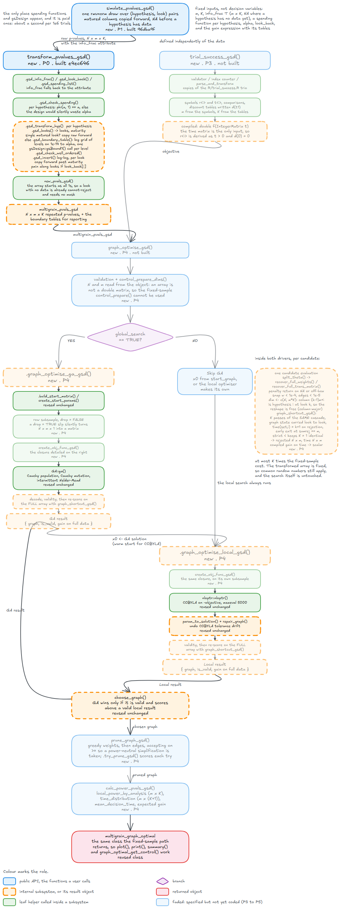

```{r}
#| include: false
knitr::opts_chunk$set(collapse = TRUE, comment = "#>")
suppressMessages(devtools::load_all("../../..", quiet = TRUE))
library(gsDesign)
set.seed(1)
```

## Who this is for

This document explains `transform_pvalues_gsd()`, the function that converts
raw group sequential p-values into repeated p-values so that a graphical
procedure can run without ever evaluating a boundary. If you are a **user** of
the package, sections 2 through 4 tell you what to call, what comes back, and
three conventions you need to know. If you are a **developer** or reviewer,
sections 5 and 6 walk through every helper function in the order it runs and
verify the implementation against independent calculations.

## The problem

In a fixed-sample trial each hypothesis produces one p-value, and the graphical
procedure compares it against the hypothesis's current share of alpha. In a
group sequential design the trial is analysed several times as data accumulate
-- say at one third, two thirds, and all of the planned information -- so each
hypothesis now has one p-value per analysis. Testing the same hypothesis
repeatedly at the same level inflates the type I error. An *alpha-spending
function* spreads the available level across the analyses, and from it one
computes a *nominal boundary* for each analysis: the p-value threshold that
spends exactly the right amount of error.

The graphical procedure still works under group sequential designs: Maurer and
Bretz (2013) showed that the familiar cascade -- reject, recycle alpha along
the edges, retest -- can be applied analysis by analysis, comparing each
p-value against its boundary instead of against the hypothesis's level. But the
boundary a hypothesis is tested against depends on its current alpha allocation,
and the graph keeps changing that allocation every time it recycles. Computing a
boundary is a multivariate normal root-find, and doing it every time the graph
moves is both expensive and tangled.



The key insight is that the boundary is *monotone* in the allocated level: more
alpha means a larger (less stringent) boundary. So instead of asking "is my
p-value below the boundary at this allocation?", one can ask the inverse
question once: "what is the smallest allocation at which my p-value would cross
the boundary?" That number is the *repeated p-value*, and once you have it, the
group sequential rejection rule becomes a fixed-sample comparison. The graph
never sees a boundary, a spending function, or an information fraction again.


## The idea: repeated p-values

Write $\alpha^*_k(\gamma)$ for the nominal boundary at analysis $k$ when the
hypothesis holds level $\gamma$. The boundary is computed from the spending
function and the information fractions; it is the largest p-value at analysis
$k$ that rejects when the hypothesis has $\gamma$ to spend. Define the
*repeated p-value* at analysis $k$ as

$$
p^r_k = \min\bigl\{\gamma : \alpha^*_k(\gamma) \ge p_k\bigr\}.
$$

Because the boundary is non-decreasing in $\gamma$ (the "well-ordered"
condition of Maurer and Bretz), the set $\{\gamma : \alpha^*_k(\gamma) \ge
p_k\}$ is an upper set $[p^r_k,\, \infty)$. Therefore, for any allocation
$\gamma$,

$$
p_k \le \alpha^*_k(\gamma) \iff p^r_k \le \gamma.
$$

This is the entire theoretical foundation: the group sequential rejection rule
"$p_k$ below the boundary at level $w_i\alpha$" is exactly the fixed-sample
rule "$p^r_k \le w_i\alpha$". The repeated p-value absorbs the spending
function, the information fractions, and the multivariate normal structure into
a single number per hypothesis per analysis. It does not depend on the graph.

The table below makes this concrete. Four levels, two analyses, Lan-DeMets
O'Brien-Fleming (LDOF) spending:

```{r}
nom_bounds <- function(gamma, t, sf = sfLDOF) {
    inc <- diff(c(0, sf(gamma, t)$spend))
    b <- gsBound1(theta = 0, I = t, a = rep(-20, length(t)), probhi = inc)$b
    pnorm(b, lower.tail = FALSE)
}

t2 <- c(0.5, 1)
levels <- c(0.001, 0.005, 0.0125, 0.025)
tab <- t(sapply(levels, nom_bounds, t = t2))
dimnames(tab) <- list(paste("gamma =", levels), c("look 1", "look 2"))
print(signif(tab, 4))
```

Suppose your analysis-2 p-value is 0.02. Read down the "look 2" column: the
boundary first exceeds 0.02 between $\gamma = 0.0125$ (boundary 0.01236) and
$\gamma = 0.025$ (boundary 0.0245). The exact $\gamma$ where the boundary
equals 0.02 is approximately 0.0204 -- that is the repeated p-value. The
interpolation in `.gsd_invert()` does this lookup precisely over a fine grid.
This connection is from Maurer and Bretz (2013), section 3.3.


## Using it

### Simulate, transform, inspect

A typical workflow starts with `simulate_pvalues_gsd()`, which produces raw
p-values under the canonical joint normal model, and then calls
`transform_pvalues_gsd()` to convert them:

```{r}
set.seed(42)
raw <- simulate_pvalues_gsd(
    power_nominal = c(0.8, 0.9),
    info_frac = c(0.5, 1),
    nsim = 5
)
dim(raw)
```

The raw array has dimensions `c(nsim, m, K)`: 5 simulations, 2 hypotheses, 2
analyses. Transform it:

```{r}
tr <- transform_pvalues_gsd(
    raw,
    spending = sfLDOF,
    grid_size = 128L
)
tr
```

The returned object is a `multigrain_pvals_gsd` with these fields:

- `pvals`: the transformed array, same dimensions as the input.
- `nsim`, `m`, `K`: the three dimensions.
- `alpha`: the level the boundary tables were built up to (default 0.025).
- `info_frac`: the `m` by `K` matrix of information fractions.
- `look_back`: which semantics each hypothesis uses.
- `spending`: a label per spending function.
- `tables`: per hypothesis, a list containing `looks` (which analyses carry
  distinct information), `maturity` (the analysis at which the hypothesis
  matures), and -- unless the short-circuit path was taken -- `grid` and
  `bounds` (the full boundary table).

The `summary()` method adds per-hypothesis detail and the nominal boundaries at
the full level:

```{r}
summary(tr)
```


### Arguments

- **`pvals`**: a three-dimensional numeric array `c(nsim, m, K)`. Values must
  lie in $[0, 1]$; `NA` is allowed for analyses where a hypothesis has no data.

- **`info_frac`**: a numeric vector of length $K$ (applied to every hypothesis)
  or an $m \times K$ matrix with `NA` where a hypothesis has no data at an
  analysis. If omitted, the function reads the `info_frac` attribute that
  `simulate_pvalues_gsd()` attaches to its output.

- **`spending`**: a spending function, or a list of $m$ of them. Because it
  follows `...`, it must be named: `spending = sfLDOF`, not just `sfLDOF`. Any
  function that takes `(alpha, t)` and returns cumulative spend works; gsDesign
  functions such as `sfLDOF`, `sfLDPocock`, and parametrised wrappers like
  `function(a, t) gsDesign::sfHSD(a, t, param = -2)` all work directly.

- **`alpha`**: the overall one-sided significance level. Default is `0.025`.

- **`look_back`**: a logical of length 1 or $m$. `TRUE` switches a hypothesis
  to sequential p-values (section 4.6 below). Default is `FALSE`.

- **`grid_size`**: a whole number giving the number of allocated levels in each
  boundary table. Default is `1024`.


### Convention 1: no data yet means cannot reject

If a hypothesis has no data at an analysis (its information fraction is `NA`),
its repeated p-value at that analysis is 1. This encodes "cannot reject"
without a separate mask:

```{r}
info_missing <- rbind(
    A = c(0.5, 1),
    B = c(NA,  1)
)
raw_miss <- array(runif(5 * 2 * 2), dim = c(5, 2, 2))
tr_miss <- transform_pvalues_gsd(
    raw_miss, info_frac = info_missing, spending = sfLDOF
)
cat("B repeated, look 1:", tr_miss$pvals[, 2, 1], "\n")
cat("B repeated, look 2:", signif(tr_miss$pvals[, 2, 2], 4), "\n")
```

Hypothesis B has no data at analysis 1, so its repeated p-value there is 1. At
analysis 2, where it has full information in a single look, its repeated
p-value equals its raw p-value (the short-circuit path applies).


### Convention 2: matured endpoints are carried forward

When an endpoint reaches full information ($t_{i,k} = 1$) its data are
complete. Its repeated p-value does not change, but the hypothesis can still be
rejected at a later analysis if recycling gives it more alpha. This is the
"PFS matures early, OS runs long" shape from the manuscript's Example 5:

```{r}
set.seed(4)
info_ex5 <- rbind(
    PFS = c(1,   1,   1),
    OS  = c(0.4, 0.7, 1)
)
raw_ex5 <- array(runif(5 * 2 * 3), dim = c(5, 2, 3))
raw_ex5[, 1, 2] <- raw_ex5[, 1, 1]
raw_ex5[, 1, 3] <- raw_ex5[, 1, 1]

tr_ex5 <- transform_pvalues_gsd(raw_ex5, info_frac = info_ex5, spending = sfLDOF)
summary(tr_ex5)
```

PFS's repeated p-value is its raw p-value at every analysis (the short-circuit
fires because it has a single look at full information), and that value is
copied forward. This matters: if OS is rejected at analysis 3 and recycles its
alpha to PFS, PFS can be picked up at analysis 3 even though its evidence has
not changed. Setting the repeated p-value to 1 after maturity would throw away
that opportunity.

If you supply different raw p-values for PFS after its maturity analysis, the
transform ignores them and warns:

```{r}
raw_bad <- raw_ex5
raw_bad[, 1, 3] <- 0.5
withCallingHandlers(
    transform_pvalues_gsd(raw_bad, info_frac = info_ex5, spending = sfLDOF),
    warning = function(w) {
        message("WARNING: ", conditionMessage(w))
        invokeRestart("muffleWarning")
    }
)
```


### Convention 3: look-back

By default (`look_back = FALSE`), a hypothesis at analysis $k$ is judged on its
analysis-$k$ evidence only, matching Algorithm 1 of Maurer and Bretz. When
`look_back = TRUE`, the repeated p-values are replaced by their running minimum
-- the *sequential p-value* $p^s_{i,k} = \min_{l \le k} p^r_{i,l}$ -- so a
hypothesis can be rejected on the strength of evidence from any earlier
analysis. In the example below, the decision changes:

```{r}
alpha <- 0.025
t3 <- c(1/3, 2/3, 1)

one <- array(1, dim = c(1, 2, 3))
one[1, 1, ] <- c(0.05, 0.003, 0.03)
one[1, 2, ] <- c(0.20, 0.10,  0.005)

pr <- transform_pvalues_gsd(one, info_frac = t3, spending = sfLDOF)$pvals[1, , ]
ps <- transform_pvalues_gsd(
    one, info_frac = t3, spending = sfLDOF, look_back = TRUE
)$pvals[1, , ]
dimnames(pr) <- dimnames(ps) <- list(c("H1", "H2"), paste0("look", 1:3))
cat("repeated p:\n");   print(signif(pr, 4))
cat("\nsequential p:\n"); print(signif(ps, 4))
```

A two-hypothesis cascade, run analysis by analysis, shows the effect:

```{r}
run_looks <- function(P) {
    w   <- c(0.5, 0.5)
    rej <- c(FALSE, FALSE)
    when <- c(0L, 0L)
    for (k in 1:3) {
        repeat {
            j <- which(!rej & P[, k] <= w * alpha)[1]
            if (is.na(j)) break
            rej[j] <- TRUE; when[j] <- k
            other <- 3 - j
            if (!rej[other]) w[other] <- w[other] + w[j]
            w[j] <- 0
        }
    }
    list(rejected = rej, at_look = when)
}

cat("without look-back:\n"); print(run_looks(pr))
cat("\nwith look-back:\n");    print(run_looks(ps))
```

At analysis 2, H1's repeated p-value is about 0.015, which exceeds its initial
allocation of 0.0125: not rejected. At analysis 3, H2 is rejected and passes
its alpha to H1, which now holds the full 0.025. Without look-back, H1 is
judged on its analysis-3 repeated p-value, which is 1 (the raw p of 0.03
exceeds the LDOF boundary even at the full level): still not rejected. With
look-back, H1 is judged on the running minimum of its repeated p-values,
min(1, 0.015, 1) = 0.015, which is below 0.025: rejected.

The default is `FALSE` because Algorithm 1 of Maurer and Bretz is the
established, regulator-familiar version, even though look-back is uniformly
more powerful. Both semantics control the FWER (design record, section 4.2). The
protocol must state which rule the trial uses; the package makes it a
per-hypothesis switch.


### Repeated p-values above alpha are reported as 1

The boundary table runs from $10^{-14}$ up to $\alpha$, not up to 1. A raw
p-value whose repeated p-value exceeds $\alpha$ means "no allocation the graph
could ever give this hypothesis would reject it", and the transform reports
that as 1. This is visible in the Maurer and Bretz (2013) Table 2 reproduction:

```{r}
p_look1 <- c(0.0062, 0.017, 0.009, 0.13)
p_look2 <- c(0.0002, 0.0035, 0.002, 0.06)
paper1  <- c(0.1141, 0.1683, 0.1316, 0.382)
paper2  <- c(0.0024, 0.0172, 0.0117, 0.1285)

mb <- array(1, dim = c(1, 4, 3))
mb[1, , 1] <- p_look1
mb[1, , 2] <- p_look2

tr_mb <- transform_pvalues_gsd(mb, info_frac = t3, spending = sfLDOF)
print(data.frame(
    hyp = paste0("H", 1:4),
    raw1 = p_look1, rep1 = signif(tr_mb$pvals[1, , 1], 4), paper1 = paper1,
    raw2 = p_look2, rep2 = signif(tr_mb$pvals[1, , 2], 4), paper2 = paper2
))
```

Every analysis-1 value, and H4 at analysis 2, comes back as 1. The paper
reports 0.114, 0.168, and so on, because it computes the mathematically exact
inverse over $(0, 1)$. The package caps at $\alpha$ because nothing above it
can matter to a decision: both 0.114 and 1 exceed 0.025 and both mean "not
rejected". This is a feature, not a bug, but it will surprise anyone comparing
output to the paper. To reproduce the paper's values, widen the grid:

```{r}
tr_wide <- transform_pvalues_gsd(
    mb, info_frac = t3, spending = sfLDOF, alpha = 0.5
)
print(data.frame(
    hyp = paste0("H", 1:4),
    rep1 = signif(tr_wide$pvals[1, , 1], 4), paper1 = paper1,
    rep2 = signif(tr_wide$pvals[1, , 2], 4), paper2 = paper2
))
```

The residual differences (up to about $10^{-4}$) are ADDPLAN versus gsDesign
numerics, the same gap the design record notes.


## Under the hood: the call chain

The numbered call chain from the call-flow document:

1. `transform_pvalues_gsd()` receives the raw array, validates it, and
   normalises every argument by calling `.gsd_info_frac()`, `.gsd_look_back()`,
   and `.gsd_spending_list()`.
2. For each hypothesis, `.gsd_check_spending()` verifies that the spending
   function spends the whole level by full information.
3. For each hypothesis, `.gsd_transform_hyp()` does the real work: it calls
   `.gsd_looks()` to find which analyses carry distinct information and when
   the hypothesis matures, then either short-circuits (single matured look)
   or builds a boundary table with `.gsd_boundary_table()`, checks monotonicity
   with `.gsd_check_well_ordered()`, and inverts it per analysis with
   `.gsd_invert()`.
4. `new_pvals_gsd()` assembles the transformed array and per-hypothesis
   metadata into an S3 object.
5. `print()` and `summary()` display the result, with `summary()` calling
   `.gsd_full_bounds()` for the boundaries at the full level.


### Argument resolution and the spending check

`.gsd_info_frac()` coerces the information fractions to an $m \times K$ double
matrix, broadcasting a vector across hypotheses. `.gsd_look_back()` normalises
`look_back` to a length-$m$ logical. `.gsd_spending_list()` wraps a single
spending function into a list of $m$ copies.

`.gsd_check_spending()` evaluates each spending function at a single
information fraction of 1 (via `.gsd_spend()`) and checks that it returns the
full level within a relative tolerance of `1e-6 * alpha`. A spending function
that stops short would silently waste alpha. `.gsd_spend()` handles the two
return conventions: a plain numeric vector or a list with a `$spend` element
(the `gsDesign` convention).


### Which looks matter: `.gsd_looks()`

Not every analysis carries distinct information for every hypothesis. PFS may
be complete at analysis 1 while OS is still accruing; a secondary endpoint may
have no data until analysis 2. `.gsd_looks()` determines which analyses to
include in the boundary table and when the hypothesis matures:

```{r}
show_looks <- function(t_row) {
    r <- multigrain:::.gsd_looks(t_row, hyp = 1)
    cat(sprintf("info_frac = (%s)  ->  looks = {%s}, maturity = %d\n",
                paste(format(t_row), collapse = ", "),
                paste(r$looks, collapse = ", "), r$maturity))
}
show_looks(c(0.5, 1))
show_looks(c(1, 1))
show_looks(c(NA, 1))
show_looks(c(0.4, 0.7))
show_looks(c(NA, 0.6, 1))
show_looks(c(0.5, 1, 1, 1))
```

Analyses after maturity are excluded because passing a repeated information
fraction of 1 to `gsBound1` produces an unrejectable boundary. The spending
increment at a repeated full-information analysis is zero, and `gsBound1`
returns a z-boundary so large that the p-value boundary underflows:

```{r}
inc <- diff(c(0, sfLDOF(0.025, c(0.5, 1, 1))$spend))
cat("spend increments for t = (0.5, 1, 1):", inc, "\n")
b <- gsBound1(theta = 0, I = c(0.5, 1, 1), a = rep(-20, 3), probhi = inc)$b
cat("p-value boundaries:", pnorm(b, lower.tail = FALSE), "\n")
```

The third boundary is approximately $2.75 \times 10^{-89}$: effectively
unrejectable. This is why `.gsd_looks()` stops at the first analysis that
reaches full information.


### The forward map: `.gsd_boundary_table()`

`gsDesign::gsBound1()` computes the z-scale upper boundaries for a one-sided
group sequential design under the null ($\theta = 0$). It takes the information
fractions in `I`, a lower (futility) bound `a` set to $-20$ (effectively
negative infinity), and the per-analysis spending increments in `probhi`. One
call returns the boundaries at all analyses, because the boundary at analysis
$l$ depends only on analyses $1, \ldots, l$.

To see how it works, compute the two-analysis LDOF boundary by hand. Analysis 1
is a one-dimensional problem: the z-boundary is `qnorm(1 - increment_1)`. Analysis
2 requires a bivariate normal root-find, because the two test statistics are
correlated with $\rho = \sqrt{t_1 / t_2}$:

```{r}
gamma <- 0.025
t <- c(0.5, 1)
cum <- sfLDOF(gamma, t)$spend
inc <- diff(c(0, cum))

# Look 1: one-dimensional
c1 <- qnorm(1 - inc[1])
b1 <- pnorm(c1, lower.tail = FALSE)

# Look 2: bivariate normal root-find
rho   <- sqrt(t[1] / t[2])
Sigma <- matrix(c(1, rho, rho, 1), 2)
p_cross_at_2 <- function(c2) {
    mvtnorm::pmvnorm(lower = c(-Inf, c2), upper = c(c1, Inf), sigma = Sigma)[1]
}
c2 <- uniroot(function(z) p_cross_at_2(z) - inc[2], c(0, 6), tol = 1e-12)$root
b2 <- pnorm(c2, lower.tail = FALSE)

# Compare with gsBound1
gs <- gsBound1(theta = 0, I = t, a = rep(-20, 2), probhi = inc)
b_gs <- pnorm(gs$b, lower.tail = FALSE)

data.frame(
    look = 1:2,
    by_hand = c(b1, b2),
    gsBound1 = b_gs,
    difference = c(b1, b2) - b_gs
)
```

`.gsd_boundary_table()` calls `gsBound1` once per grid level and stacks the
results. The grid of allocated levels is log-spaced from `gsd_grid_min = 1e-14`
up to `alpha`:

```{r}
#| eval: false
grid_levels <- exp(seq(log(1e-14), log(alpha), length.out = grid_size))
```

Log spacing matters because boundaries span many orders of magnitude. The LDOF
analysis-1 boundary underflows to about $2.75 \times 10^{-89}$ below
$\gamma \approx 10^{-6}$. A linear grid would waste almost all its points
where the boundaries are large and have no resolution where they are tiny. On
log-log axes the curves are smooth and nearly linear, which is why log-log
interpolation works well:

```{r}
#| fig-cap: "Boundary table on log-log axes. The look-2 curve hugs the diagonal (boundary ~ level) because LDOF spends almost everything at the final analysis. The look-1 curve is far below."

tab_plot <- multigrain:::.gsd_boundary_table(
    t_look = c(0.5, 1), spending = sfLDOF, alpha = 0.025,
    grid_size = 128, hyp = 1
)

keep1 <- tab_plot$bounds[, 1] > 1e-80
plot(tab_plot$grid, tab_plot$bounds[, 2], log = "xy", type = "l", lwd = 2,
     xlab = "allocated level (gamma)", ylab = "nominal boundary",
     main = "Boundary table, LDOF, t = (0.5, 1)")
lines(tab_plot$grid[keep1], tab_plot$bounds[keep1, 1], lwd = 2, col = "steelblue")
abline(0, 1, lty = 3)
legend("topleft", c("look 2", "look 1", "boundary = level"),
       col = c("black", "steelblue", "black"), lty = c(1, 1, 3),
       lwd = c(2, 2, 1))
```

The first few rows of the table show the underflow at analysis 1:

```{r}
cat("first 5 rows (levels near 1e-14):\n")
print(cbind(level = tab_plot$grid[1:5], tab_plot$bounds[1:5, ]))
```

The constant $2.75 \times 10^{-89}$ values are not real boundaries; they are
`gsBound1` underflowing when asked for a crossing probability of roughly
$10^{-30}$. `.gsd_invert()` handles them by dropping duplicated entries before
interpolating.


### The well-ordering check: `.gsd_check_well_ordered()`

A spending function is *well ordered* if its nominal boundary is non-decreasing
in the allocated level at every analysis. If a spending function violates this,
the sequentially rejective graphical procedure is not valid (Maurer and Bretz,
condition 2), and the transform must refuse rather than silently produce wrong
results. Here is a spending function that spends *less* at analysis 1 as the
level goes up:

```{r}
bad_sf <- function(a, t) {
    early <- pmin(a, 0.002 * (1 - a / 0.025))
    ifelse(t >= 1, a, early)
}
cat("bad_sf look-1 spend at a = 0.005, 0.015, 0.025:",
    bad_sf(c(0.005, 0.015, 0.025), 0.5), "\n")

res <- tryCatch(
    multigrain:::.gsd_boundary_table(
        t_look = c(0.5, 1), spending = bad_sf, alpha = 0.025,
        grid_size = 64, hyp = 1
    ),
    error = function(e) e
)
cat("\nwell-ordering check said:\n")
cat(conditionMessage(res), "\n")
```

The check uses a tolerance of `sqrt(.Machine$double.eps)` times the column
maximum (approximately $1.49 \times 10^{-8}$ relative) to accommodate
floating-point noise from `gsBound1`. Decreases smaller than this are allowed;
decreases larger than it abort with a message naming the hypothesis and the
analysis.


### The inverse: `.gsd_invert()`

`.gsd_invert()` maps raw p-values to repeated p-values by log-log linear
interpolation on the boundary table. The input is one column of the boundary
table (one analysis), the grid of allocated levels, and the raw p-values to
invert. The output is a vector of repeated p-values, one per simulation.

Three clamp rules handle values outside the table:

- **Above the table** ($p \ge$ the boundary at $\alpha$): no allocation up to
  $\alpha$ would reject it. Repeated p-value is 1.
- **Below the table** ($p <$ the smallest positive boundary): the repeated
  p-value is floored at `gsd_grid_min = 1e-14`, not 0. This matters because
  the optimiser's weight-snapping can produce allocations as small as
  $10^{-4} \times 10^{-5} \times 0.025 = 2.5 \times 10^{-11}$. A floor of 0
  would let any p-value below the table reject at any positive allocation,
  causing spurious rejections. The floor at $10^{-14}$ avoids this.
- **Missing** ($p$ is `NA`): repeated p-value is 1 (cannot reject).

Interpolation error decreases as the grid gets finer:

```{r}
nom_bounds_fn <- function(gamma, t, sf = sfLDOF) {
    inc <- diff(c(0, sf(gamma, t)$spend))
    b <- gsBound1(theta = 0, I = t, a = rep(-20, length(t)), probhi = inc)$b
    pnorm(b, lower.tail = FALSE)
}

exact_inv <- function(p, k, t) {
    uniroot(function(g) nom_bounds_fn(g, t)[k] - p, c(1e-13, 0.025),
            tol = 1e-12)$root
}

set.seed(2)
t_inv <- c(0.5, 1)
p_test <- 10^runif(40, -8, log10(0.02))
truth <- sapply(p_test, exact_inv, k = 2, t = t_inv)

for (G in c(128, 256, 512, 1024)) {
    tb <- multigrain:::.gsd_boundary_table(
        t_look = t_inv, spending = sfLDOF, alpha = 0.025,
        grid_size = G, hyp = 1
    )
    est <- multigrain:::.gsd_invert(tb$bounds[, 2], grid = tb$grid, p = p_test)
    cat(sprintf("G = %4d  max relative error = %.2e\n", G,
                max(abs(est - truth) / truth)))
}
```

The error roughly quarters each time the grid size doubles, consistent with
linear interpolation on a log-log scale. At the default `grid_size = 1024` the
maximum relative error is about $1.5 \times 10^{-6}$, which is negligible
compared with Monte Carlo noise in the objective.


### The short-circuit

If a hypothesis has exactly one analysis at full information ($|L_i| = 1$ and
$t_i \ge 1$), the boundary at level $\gamma$ is $\gamma$ itself: the spending
function is exhausted in one analysis, so the nominal boundary equals the
allocated level. The repeated p-value is therefore the raw p-value, with no
table and no interpolation.

This short-circuit exists because `gsBound1` at a single analysis with $t = 1$
does not return the level exactly:

```{r}
a <- 0.0125
b <- gsBound1(theta = 0, I = 1, a = -20, probhi = a)$b
boundary <- pnorm(b, lower.tail = FALSE)

cat("level a          :", format(a, digits = 17), "\n")
cat("gsBound1 boundary:", format(boundary, digits = 17), "\n")
cat("identical?", identical(boundary, a), "\n")
cat("difference:", boundary - a, "\n")
```

The difference is of order $10^{-17}$, but it is not zero. If the transform
built a one-column table and inverted it, a raw p-value of exactly 0.0125 might
not come back as exactly 0.0125, breaking the requirement that $K = 1$ be
bit-identical to the fixed-sample kernel. The short-circuit avoids this
entirely:

```{r}
set.seed(1)
raw_k1 <- array(runif(6), dim = c(3, 2, 1))
attr(raw_k1, "info_frac") <- matrix(1, 2, 1)

tr_k1 <- transform_pvalues_gsd(raw_k1, spending = sfLDOF)
cat("identical to raw?", identical(raw_k1[, , 1], tr_k1$pvals[, , 1]), "\n")
cat("table built?", !is.null(tr_k1$tables[[1]]$bounds), "\n")
```

The same short-circuit fires for any hypothesis that matures at its first
analysis, such as PFS in the Example 5 configuration.


### Assembly: `new_pvals_gsd()` and `.gsd_full_bounds()`

`new_pvals_gsd()` is the S3 constructor. It wraps the transformed array and all
metadata into a list with class `multigrain_pvals_gsd`. The `n_look` parameter
is stored under the name `K` in the returned object. It does no validation;
`transform_pvalues_gsd()` has already done it.

`.gsd_full_bounds()` extracts the nominal boundary of each hypothesis at each
analysis when it holds the full level $\alpha$. For the short-circuit case
(no table), the boundary is simply $\alpha$. Otherwise it reads the last row
of the boundary table, which corresponds to the largest grid level. It is used
only by `summary()`.


## Why it is right

Three checks: the transform matches a hand-rolled implementation, the
repeated-p-value rejection rule agrees with the direct boundary comparison on
every decision, and the type I error rate under the global null is controlled.

### The hand-rolled implementation matches to floating-point precision

A 15-line implementation of the forward-map-then-invert logic, applied to 200
simulated trials, agrees with the package to machine precision:

```{r}
my_transform <- function(pvals, t, sf, alpha = 0.025, G = 1024) {
    grid <- exp(seq(log(1e-14), log(alpha), length.out = G))
    B    <- t(sapply(grid, nom_bounds_fn, t = t, sf = sf))
    out  <- pvals
    for (k in seq_along(t)) {
        col  <- B[, k]
        keep <- !duplicated(col) & col > 0
        p    <- pvals[, , k]
        r    <- exp(approx(log(col[keep]), log(grid[keep]),
                           xout = log(p), rule = 1)$y)
        r[p >= max(col)]       <- 1
        r[p < min(col[keep])]  <- 1e-14
        out[, , k] <- r
    }
    out
}

set.seed(3)
t_check <- c(1/3, 2/3, 1)
raw_check <- simulate_pvalues_gsd(c(0.8, 0.9), info_frac = t_check, nsim = 200)
mine <- my_transform(raw_check, t_check, sfLDOF)
pkg  <- transform_pvalues_gsd(raw_check, spending = sfLDOF)$pvals

cat("max abs difference, hand vs package:", max(abs(mine - pkg)), "\n")
```


### The equivalence holds on 18,000 decisions

For 300 random p-values at each of 3 analyses and 20 random allocations in
$(0, \alpha]$, the two decision rules agree on every one of the $300 \times 3
\times 20 = 18{,}000$ comparisons:

```{r}
set.seed(6)
n_p <- 300
n_a <- 20
p_draw <- 10^runif(n_p, -7, log10(0.3))
a_draw <- 10^runif(n_a, -6, log10(0.025))

raw_eq <- array(1, dim = c(n_p, 1, 3))
for (k in 1:3) raw_eq[, 1, k] <- p_draw
pr_eq <- transform_pvalues_gsd(
    raw_eq, info_frac = t_check, spending = sfLDOF
)$pvals[, 1, ]

B_at_a <- t(sapply(a_draw, nom_bounds_fn, t = t_check))

disagree <- 0L; total <- 0L
for (ia in seq_len(n_a)) {
    for (k in 1:3) {
        direct  <- p_draw <= B_at_a[ia, k]
        via_rep <- pr_eq[, k] <= a_draw[ia]
        disagree <- disagree + sum(direct != via_rep)
        total    <- total + length(p_draw)
    }
}
cat(sprintf("decisions compared: %d\n", total))
cat(sprintf("disagreements     : %d\n", disagree))
```

A disagreement could come only from interpolation error, and only when the
repeated p-value sits within about $10^{-6}$ relative of the allocation
threshold. The design record argues this affects of the order of one simulated
row in a million.


### FWER is controlled under the global null

Under the null (power equal to $\alpha$, so the noncentrality is zero), the
any-analysis rejection rate of the repeated-p-value test should equal the
spending function's total spend, which is $\alpha$ by construction. Compare with
the naive approach of testing the raw p-value against $\alpha$ at every
analysis, which inflates the FWER:

```{r}
set.seed(7)
nsim_null <- 2e4
null <- simulate_pvalues_gsd(0.025, info_frac = t_check, nsim = nsim_null)
prn  <- transform_pvalues_gsd(null, spending = sfLDOF)$pvals[, 1, ]

reject_any <- apply(prn <= 0.025, 1, any)
rate <- mean(reject_any)
se   <- sqrt(0.025 * (1 - 0.025) / nsim_null)
cat(sprintf("nominal alpha        : %.4f\n", 0.025))
cat(sprintf("simulated FWER       : %.4f  (MC s.e. %.4f)\n", rate, se))

naive <- mean(apply(null[, 1, ] <= 0.025, 1, any))
cat(sprintf("naive every-look FWER: %.4f  (inflated)\n", naive))
```

The correct rate is close to 0.025 (within a few Monte Carlo standard errors),
while the naive rate is roughly double, illustrating the inflation that the
spending function prevents.


## Further reading

- `dev/callflows/transform_pvalues_gsd.md`: prose walk-through of every
  function in the order the code executes.
- `dev/gsd_design_record.md`, Part I (the extension in plain language),
  sections 4.1 (the transform specification) and 4.2 (repeated vs sequential
  semantics), and Appendices A and B (reproduction of Maurer and Bretz tables
  and end-to-end equivalence).
- The exercise scripts in this folder (`01_one_look.R` through
  `08_why_it_works.R`): hands-on computations behind every claim in this
  document.
- Maurer W, Bretz F (2013). "Multiple testing in group sequential trials using
  graphical approaches." *Statistics in Biopharmaceutical Research*, 5(4):311--320.
