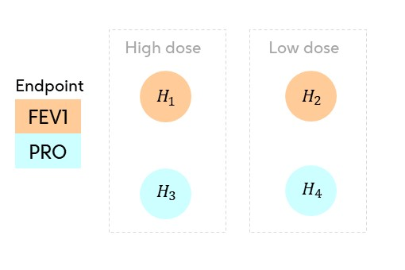
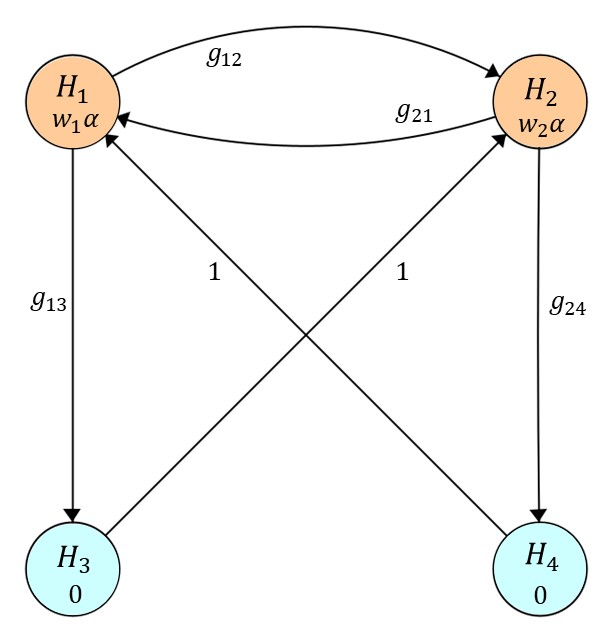

```{r setup, include=FALSE}
knitr::opts_chunk$set(
    collapse = TRUE,
    comment = "#>"
)
```

```{r, echo=FALSE, eval=TRUE, results='hide', message=FALSE}
library(multigrain)
library(ggplot2)
```


```{css, echo=FALSE}
/* Custom collapsible box */
details.important-collapsible {
  background-color: #eeeeee;
  border: 1px solid #f5c6cb;
  border-left: 5px solid #d93025;
  padding: 1em;
  margin: 1.2em 0;
  border-radius: 5px;
}

/* Style of clickable title */
details.important-collapsible summary {
  font-weight: bold;
  cursor: pointer;
  color: #b92c28;
}

/* Space below the title only when the box is open */
details.important-collapsible[open] > summary {
  margin-bottom: 0.5em;
}
```

## What Does **`multigrain`** Do?

The **`multigrain`** package is designed to optimise graph-based multiple testing procedures by identifying the hypothesis and transition weights that maximise a user-defined definition of trial success, given an expected distribution of test statistics.


A graphical test has:

1. An **$m$-length hypothesis weight vector** (*$w$*), which determines how $\alpha$
is initially allocated between hypotheses in the graph.
2. A **transition matrix** ($\mathbf{G}$) of dimensions $m \times m$ which determines
how $\alpha$ can be recycled from a null hypothesis after it has been rejected to other
unrejected hypotheses.

Optimising for different power metrics or trial success criteria will often
lead to distinct graphs, i.e., distinct
values for the parameters that make up the hypothesis weight vectors ($w$),
and the transition matrices ($\mathbf{G}$).

Each trial success measure has its own optimal configuration
of these parameters that maximizes the desired success criterion.
The **`multigrain`** function `graph_optimise()` is the tool that identifies
these optimal parameters, enabling users to find the graph that gives that
highest value for their chosen trial success measure.


## Motivating Example

Consider a two-arm parallel confirmatory clinical trial to compare a high and low dose of
an investigational treatment in patients with asthma versus placebo.

There are two endpoints included in the multiplicity adjustment:

- a primary endpoint, FEV1;
- a secondary endpoint, a patient-report outcome (PRO).

Thus there are four hypotheses, the primary hypotheses $H_1$ and
$H_2$ on FEV1 comparing high and low dose of the investigational treatment against placebo,
and the secondary hypotheses $H_3$ and $H_4$ on the PRO endpoint for the high and
low dose comparisons against placebo.




The secondary hypothesis for the PRO endpoint will only be tested after the
corresponding primary endpoint FEV1 has been rejected for the same dose.

## Inputs for optimisation by **`multigrain`**

Optimisation of graphical tests is conducted using the function
`graph_optimise()` from the **`multigrain`** package.

In order to optimise a graph-based multiple testing procedure, we require three things:

1. P-value matrix approximating joint distribution of p-values
2. A trial success measure
3. Required constraints on a graph

### P-value matrix approximating the joint distribution of p-values

`graph_optimise()` expects a matrix $\mathbf{P}$ of **raw p-values** with dimension $n_{\text{sim}}\times m$.

Each row $i$ is a simulation of p-values from the $m$ null hypotheses
$H_1, H_2, ..., H_m$ under the alternative hypothesis that configuration you
wish to evaluate.

There are two equivalent ways to provide $\mathbf{P}$:

1. **Supply your own p-value matrix** (e.g., from end-to-end trial simulation).
2. **Generate $\mathbf{P}$ with** `simulate_pvalues()`, which uses the standard
normal-approximation for one-sided test statistics (described next).

#### From the joint test statistic distribution to p-value matrix

At the design stage it is common to assume the one-sided test statistics are jointly
normal:

$$
\boldsymbol{Z} \sim \mathrm{MVN}(\boldsymbol{\Delta}, \boldsymbol{\Sigma}),
$$

where:

* $\boldsymbol{\Delta}$ are the _non-centrality parameters_ (NCPs) reflecting
the standardised effect sizes,
* $\boldsymbol{\Sigma}$ is the correlation matrix describing the dependence
between the test statistics.

Each "raw" p-value (a p-value *unadjusted* for multiplicity) arises from the transformation:

$$
p_i = 1 - \operatorname{\Phi}(z_i)
$$

so the p-values inherit a joint distribution determined entirely by
$(\boldsymbol{\Delta}, \boldsymbol{\Sigma})$.

Often you know the one-sided **nominal per-hypothesis power** (the power of each
hypothesis unadjusted for multiplicity) - $\pi_i = 1 - \beta_i$ -
at level $\alpha$, rather than the non-centrality parameter $\Delta_i$.
There is a one-to-one relationship between $\pi_i$ and $\Delta_i$:

$$
\Delta_i \;=\; \Phi^{-1}(1-\alpha)\;-\;\Phi^{-1}(1-\pi_i).
$$

[`simulate_pvalues()`] performs this conversion internally, simulates $\boldsymbol{Z}\sim\mathrm{MVN}(\boldsymbol{\Delta},\boldsymbol{\Sigma})$, and
returns raw p-values $p_i=1-\Phi(Z_i)$ to generate a matrix of `nsim`
simulations.

<details class="important-collapsible">
<summary>Important: Note on One-Sided Tests and Power Terminology</summary>

##### **One-Sided Tests** and **Power Terminology**

When designing and optimising a graph, it's essential to use a
**one-sided testing framework**. The simulation engine in
**`multigrain`** is built on a model of one-sided test statistics,
assuming $z \sim \mathrm{MVN}(\boldsymbol{\Delta}, \boldsymbol{\Sigma})$, to
correctly represent the *direction* of a treatment's effect. For this reason,
you should specify a one-sided alpha level (e.g., $\alpha = 0.025$, which is also the default being used).

##### **Power Terminology**

Furthermore, the term for the input power vector
(`power_nominal` in `simulate_pvalues()`) can be a point of confusion.
We use the term **nominal per-hypothesis power** to refer to the power of each
hypothesis *before* any multiplicity adjustment, as if it were tested in
isolation at the full alpha level. This is distinct from the **local power**,
which is the actual probability of rejecting a hypothesis *after* the graphical
procedure is applied.

</details>

#### Asthsma example: simulating the p-value matrix using `simulate_pvalues()`

with working correlation matrix for $(H_1,\dots,H_4)$:

$$
\boldsymbol{\Sigma} =
\begin{bmatrix}
1 & 0.5 & 0.8 & 0.4 \\
0.5 & 1 & 0.4 & 0.8 \\
0.8 & 0.4 & 1 & 0.5 \\
0.4 & 0.8 & 0.5 & 1
\end{bmatrix}.
$$

```{r simulate_pvals_asthma, echo=TRUE}
power_vector <- c(0.97, 0.91, 0.86, 0.83)
corr_matrix <- matrix(
  c(1, 0.5, 0.8, 0.4,
    0.5, 1, 0.4, 0.8,
    0.8, 0.4, 1, 0.5,
    0.4, 0.8, 0.5, 1),
  nrow = 4, byrow = TRUE
)

set.seed(1)
pvals <- simulate_pvalues(
    power_nominal = power_vector,
    alpha = 0.025,
    corr_matrix = corr_matrix,
    nsim = 1e6 # Increase for greater precision
)

dim(pvals) # n.sim × 4
head(pvals) # first few rows
```


### Trial Success Measure {#trial-success-measure}

The **trial success measure** is the target quantity that `graph_optimise()` maximises.
It encodes the success criteria for a trial by mapping the outcomes of the graphical
test to a numerical score. (A dedicated vignette on trial success measures
is planned for a future release.)

After analyzing the collected data from our trial, we obtain four raw p-values:
$p_1, p_2, p_3, p_4$, each corresponding to one of our hypotheses
$H_1, H_2, H_3, H_4$.

Our output after applying our graphical test to our p-values
will be a binary rejection vector:

$$\boldsymbol{r} = (r_1, r_2, r_3, r_4)$$

where $r_i = 1$ if $H_i$ is rejected, and $0$ otherwise.

The trial success measure is then defined as the expected value of a
user-specified function of $\boldsymbol{r}$. In our asthma example, we
will use two different examples of trial success measures:

1. **Average Power:** This measures the mean proportion of hypotheses rejected across trials:
$$
   \text{Average Power} = \mathbb{E} \left[ \frac{1}{4} ( r_1 + r_2 + r_3 + r_4 ) \right]
$$

2. **Custom Trial Success:** In our example, it seems natural to declare a trial
successful if at least one of the two primary dose-control comparisons
($H_1$ or $H_2$) is statistically significant.
Rejecting a key secondary ($H_3$ or $H_4$) would be
'nice to have,' but not essential for claiming the success of a trial.
It also seems natural that we should not ascribe additional benefit
for rejecting a secondary hypothesis without having first rejected
the associated primary hypothesis for the same dose. Therefore we can
construct the following power objective for our example:

   - Success for rejecting at least one of the
   two primary dose-control comparisons $H_1$ or $H_2$
   (but no extra credit for rejecting both)
   - $H_3$ and $H_4$ only add value if their corresponding primary endpoints
   ($H_1$ and $H_2$) are also rejected.

$$
  \text{Custom Trial Success} = \mathbb{E} \left[ \frac{1}{4} \left( 2 \times \mathbb{I}(r_1 + r_2 \geq 1) + r_1 \times   r_3 + r_2 \times r_4 \right) \right]
$$
where:
$$
  \mathbb{I}(r_1 + r_2 \geq 1) =
    \begin{cases}
    1, & \text{if } r_1 \text{ or } r_2 = 1 \\
    0, & \text{otherwise}
    \end{cases}
$$

#### Implementing trial success measures using `trial_success()`

We can create functions to quickly calculate our trial success measures during
graph optimisation by using the `trial_success()` functions.
This function will output a `trial_success` object, which will contain a
function we will use to calculate our custom trial success measure during and
after optimisation, allowing us to evaluate the performance of different graphs.
`trial_success()` will write this function in C++ using the `Rcpp` package.

```{r objective_function, echo=TRUE, results='hide'}
# Creating power objective functions as targets for optimisation
average_power <- trial_success(0.25 * (r1 + r2 + r3 + r4))
custom_trial_success <- trial_success(
    0.25 * (2 * (r1 && r2) + r1 * r3 + r2 * r4)
)
```

Multiplying our objective functions by $0.25$ scale our objective functions so that
they are in the interval $[0, 1]$, but this is not necessary for optimisation.

### Constraints on a graph

Let us assume that we decide _a priori_ to avoid testing a secondary hypothesis for a dose-control comparison without having rejected the associated primary hypothesis. We can ensure that the optimal graph is found within this logical constraint by using the `graph_constraint()` function.

```{r graph_constraint}
# Creating a graph constraint object to enforce logical constraints
# on order of rejections

hyp_constraint <- c(NA, NA, 0, 0)
trans_constraint <- matrix(
  c(0, NA, NA, 0,
    NA, 0, 0, NA,
    0, 1, 0, 0,
    1, 0, 0, 0),
  nrow = 4,
  byrow = TRUE
)

my_constraint <- graph_constraint(
    hyp_constraint = hyp_constraint,
    trans_constraint = trans_constraint
)

print(my_constraint)
```

- `NA` signifies "no constraint", i.e., the hypothesis weight or transition
weight can take any value within $[0, 1]$ (as long as the hypothesis weights
or sum of the transition matrix rows sum to 1).
- If a weight vector or matrix element contains a number (e.g., 1),
it means means the corresponding hypothesis or transition weight is fixed
and will not be optimised.
- A zero as an element in the transition matrix means no (initial) edge is allowed between
the corresponding hypotheses.
- All diagonals must be zero in the transition matrix (as alpha must be propagated)
to other hypotheses after rejection.

The above code leads to the following general graph:




Only the hypothesis weights $w_1, w_2$ and transition weights
$g_{12}, g_{21}, g_{13}, g_{24}$ will be optimised.

Although not necessary, setting constraints on a graph can speed up the optimisation
since we will have less parameters to optimise.

We can check the constraints using `plot(my_constraint)` (see below):

```{r graph_constraint_plot}
plot(my_constraint)
```

Please see the [dedicated vignette](articles/graph_constraint.html) on this topic for more details about setting and plotting graph constraints.

## Optimising the graph

Now we have our inputs (assumed test statistic distribution, a `trial_success`
object containing our function to quickly calculate the trial success measure,
and optional constraints on the graph), we are ready to optimise using
`graph_optimise()`. We will optimise for our two objective functions, `average_power`
and `custom_trial_success` separately.


```{r optimisation, echo=TRUE, eval=FALSE}
# Find optimal graph based on average power objective function
graph_average_power <- graph_optimise(
    pvals = pvals,
    graph_constraint = my_constraint,
    alpha = 0.025, # one-sided
    trial_success = average_power
)

# Find optimal graph based on custom power objective function (defined earlier)
graph_custom_trial_success <- graph_optimise(
    pvals = pvals,
    graph_constraint = my_constraint,
    alpha = 0.025, # one-sided
    trial_success = custom_trial_success
)
```


<details class="important-collapsible">
<summary>Important: Tuning the optimiser for precision vs. speed
(click to reveal)</summary>

##### **Tuning the Optimiser for Precision vs. Speed**

The back-end of `graph_optimise()` executes two searches in sequence:

1. a **global** search of the solution space using a genetic algorithm;
2. a **local** "hill-climbing" algorithm (COBYLA) that refines the best region found by the global search.

All tuning is done through a `multigrain_control()` object, which is
passed to `graph_optimise()` via the `control` argument.

**Number of simulations**

`control_nsim_global()` and `control_nsim_local()` set the number of
p-value rows used to evaluate trial success during the global and local
phases respectively:

```r
ctrl <- multigrain_control() |>
  control_nsim_global(50000) |>
  control_nsim_local(500000)
```

- We recommend **at least 50,000** simulations for the global search
  if the graph will be used in a protocol/SAP.
- The local search should use **as many simulations as possible**
  (at least 500,000). By default `graph_optimise()` uses all rows of
  the `pvals` matrix you provide.

**Stopping the global search**

The global search (genetic algorithm) stops after the trial success
measure fails to improve for a number of consecutive generations. This
is controlled by the `run` parameter (from `GA::ga()`), accessible via
`control_global()`:

```r
ctrl <- ctrl |>
  control_global(run = 1000)
```

- The default is **200** generations, which returns a graph quickly.
- For a graph that will be used in a protocol/SAP, set `run` to at
  least **1000** to ensure a thorough search.

**Parallel execution**

For large problems with many hypotheses (m ≥ 6), enable parallel execution via the `num_threads` argument of `graph_optimise()`:

```r
g_opt <- graph_optimise(
  pvals = pvals,
  graph_constraint = my_constraint,
  alpha = 0.025,
  trial_success = custom_trial_success,
  num_threads = 4
)
```

**Skipping the global search**

Additionally, if you already have a good starting graph, you can skip the global search entirely by setting `global_search` to `FALSE`:

```r
g_opt <- graph_optimise(
  pvals = pvals,
  graph_constraint = my_constraint,
  alpha = 0.025,
  trial_success = custom_trial_success,
  global_search = FALSE,
  num_threads = 4
)
```

**Putting it together**

```r
ctrl <- multigrain_control() |>
  control_nsim_global(50000) |>
  control_nsim_local(1e6) |>
  control_global(run = 1000)

g_opt <- graph_optimise(
  pvals = pvals,
  graph_constraint = my_constraint,
  alpha = 0.025,
  trial_success = custom_trial_success,
  num_threads = 4,
  control = ctrl
)
```

</details>

## Results

Once optimised, we can retrieve a summary from the `optimal_graph` objects
produced by `graph_optimise()`:

```{r, echo=TRUE, eval=FALSE}
print(
    "Summary of the optimisation results for the graph optimised for AVERAGE power"
)
summary(graph_average_power)
```

```{r results, echo=FALSE}
print(
    "Summary of the optimisation results for the graph optimised for AVERAGE power"
)
graph_average_power <- readRDS("./data/get-started-avg-power-graph.rds")
print(graph_average_power)
print(
    "Summary of the optimisation results for the graph optimised for CUSTOM power"
)
graph_custom_trial_success <- readRDS(
    "./data/get-started-custom-power-graph.rds"
)
print(graph_custom_trial_success)
```

We can plot the graph using the `plot()` function for the `optimal_graph` objects.

```{r plot, my-plot, fig.width=8, fig.height=4.5, out.width='100%'}
p1 <- plot(graph_average_power) +
    ggtitle("Optimal Graph for Average Power") +
    theme(
        plot.title = element_text(
            hjust = 0.5,
            size = 14,
            margin = margin(0, 0, 30, 0)
        )
    )

p2 <- plot(graph_custom_trial_success) +
    ggtitle("Optimal Graph for Custom Success") +
    theme(
        plot.title = element_text(
            hjust = 0.5,
            size = 14,
            margin = margin(0, 0, 30, 0)
        )
    )

gridExtra::grid.arrange(p1, p2, ncol = 2)
```

## Evaluating Trial Success

We can evaluate the power / trial success of each graph by using the
`calc_power_pvals()` function.

```{r calc_power}
# Calculate power for graph optimised for average power
graph_avg_power_metrics <- calc_power_pvals(
    pvals,
    alpha = 0.025,
    hyp_weight = graph_average_power$hyp_weight,
    trans_matrix = graph_average_power$trans_matrix,
    custom_power = list("CustomSuccess" = custom_trial_success)
)

# Expected Rejections / 4 is equal to average power
print(graph_avg_power_metrics)

# Calculate power for graph optimised for custom power metric
graph_custom_ts_metrics <- calc_power_pvals(
    pvals,
    alpha = 0.025,
    hyp_weight = graph_custom_trial_success$hyp_weight,
    trans_matrix = graph_custom_trial_success$trans_matrix,
    custom_power = list("CustomSuccess" = custom_trial_success)
)

# Expected Rejections / 4 is equal to average power
print(graph_custom_ts_metrics)
```


```{r table_power, echo=FALSE}
graph_avg_power_metrics$AvgPower <- graph_avg_power_metrics$exp_rejections / 4
graph_custom_ts_metrics$AvgPower <- graph_custom_ts_metrics$exp_rejections / 4

df <- rbind(
    unlist(graph_avg_power_metrics)[c(1:4, 9, 8)],
    unlist(graph_custom_ts_metrics)[c(1:4, 9, 8)]
) |>
    as.data.frame() |>
    dplyr::mutate(
        Graph = c("Optimised for AvgPower", "Optimised for CustomPower")
    ) |>
    dplyr::select(Graph, everything())


colnames(df) <- c(
    "Graph",
    "H1",
    "H2",
    "H3",
    "H4",
    "Average Power",
    "Custom Success"
)
knitr::kable(
    df,
    format = "markdown",
    digits = 3
)
```

In the table above:

- Columns `H1` - `H4` show the _local_ power of each hypothesis under the graph
and the assumed test statistic distribution,
- `Average Power` and `Custom Success` show the value of the objective functions
defined in the section on [trial success measures](#trial-success-measure).


## Further reading

For more detail on constraining graph structure, see the [Graph Constraints](graph_constraint.html) vignette.
